=========================================
.. title:: Digital operator; Could i help?
=========================================

My thoughts on Digital GM position
----------------------------------

These are my thoughts and notes for GM Digital position. Notes are 

.. contents::

Review of status in Digitalization 
----------------------------------

Here are general views one what can be done. I tray to partition issues into different non-overlapping areas. 

1. **Digitalize operations**

- Internal processes digitalization. 

- Digital strategy to cover all aspects of the business

- Achieve a superior efficiency and cost advantage to compete with leaner and more agile competitors. 

   1.1 *Are we digital now?*
	
   1.2 *What are missed?*
	
   1.3 *where and how we can improve?*
      
      1.3.1 ITS
      
      1.3.2 NWG
      
      1.3.3 MKT and Bussiness planning
		
   1.4 *What and where do we need improvment?*
   
   	1.4.1 Slide 

2. **Look for digital practices beyond the telco industry**

- Digitalization initiated in multiple other adjacent and unrelated industry ecosystems. 

- Look for inspiration from applications and use cases across other industries.
   
   - sample?

3. **Transform at an optimal scale**

- How to transform?

 Adopt an iterative, agile and impact-oriented transformation approach

- Starting with a handful of concepts, i.e. low hanging friuts 

- Opportunities for collaboration with start-ups and partners must be leveraged to bring innovation from the broader ecosystem and bridge capability gaps across the organization.

4. **Adopt a robust governance model**

4.1 *Challenges to derive*
    
    - Scarce capabilities and expertise
    
    - Need Executive sponsorship

5. **Existing Competiotors and challenges**

   5.1 *General Challenges for Telco's - Slide*

Overhaul or redesign of strategies 
----------------------------------

A complete strategic overhaul, including new, non-core market entries and radical organizational restructuring for a 
quad-play European incumbent.

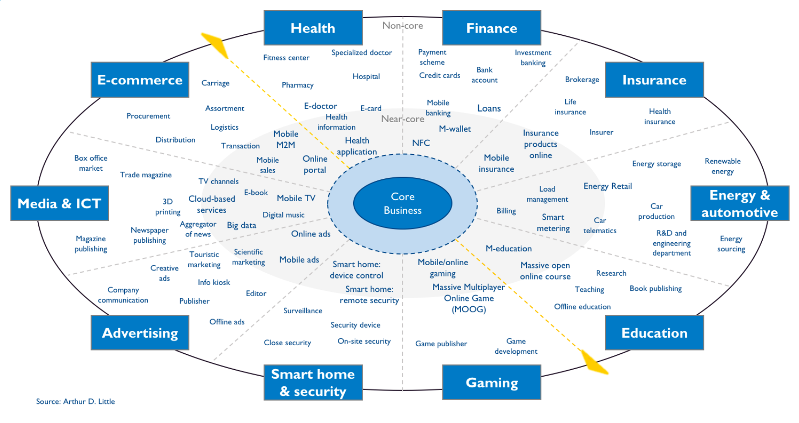

Web link ADL_W1_1_. 

.. _ADL_W1_1: https://www.adlittle.com/en/career/case-studies/telco-diversification-strategy-reverse-ebitda-decline 

[Ref1]_ 

General Challenges for Telco's 
------------------------------ 

What are general Challenges for Mobile Operator? 

1. Threat of new entrants

  - No special risk for now as new Telcom Operator is unlikely = Main barriers are huge needed investments, Sactions for seting up new operation, lic,etc.
  - Rightel may impose risk if it could manage to perform rationally which is very unlikley. 
  
2. Threat of substitutes

  - There is threat for digital services as any company with acceptable service may take a lead and grasp subscribers.
  
3. Bargaining power of customers
 
 - It is different per service and product. For some with free foreigne provider, internal/local's are not attracttive due to so many reasons.  
4. Bargaining power of suppliers

  - International providers may impose special request due to limitations and status of Iran Market.
 
5. Competitive rivalry

   - MCI threat to invest and compete
   - Competitive strategy from Shatel o other players

Next slides, present general challange status for Telcos.

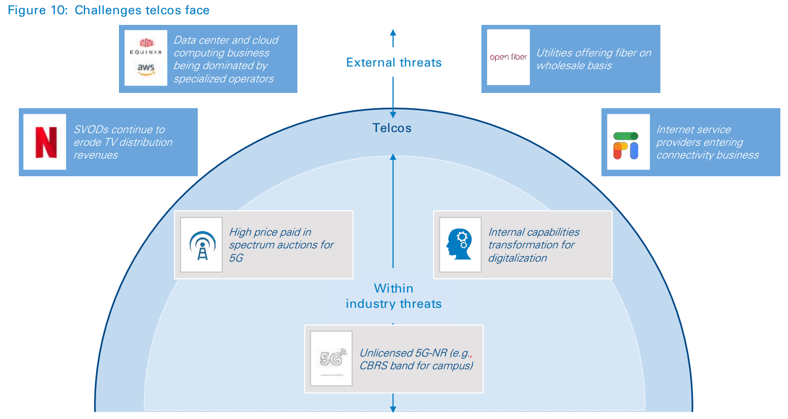
        

- Web link ADL_2.
.. _ADL_2:  ?

Trends in Digital Economy 
------------------------- 

- Global Trends which affect DE.

- What are estimates for Iran?

- What can we do? 

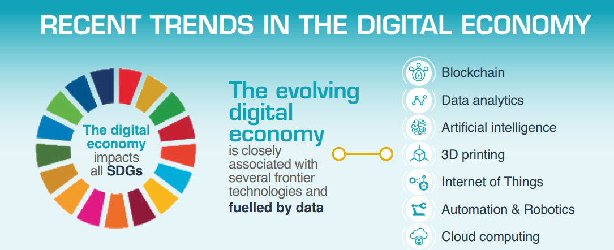

Data Usage increase
------------------- 

**What will be Iran trend?**

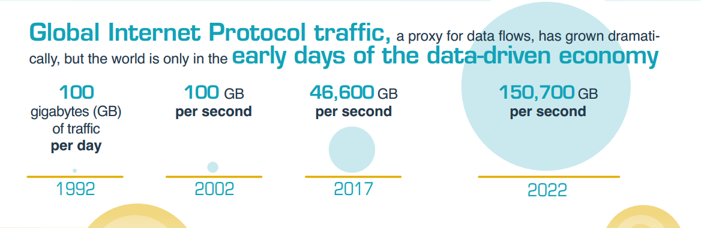

Digital Economy Speard 
---------------------- 

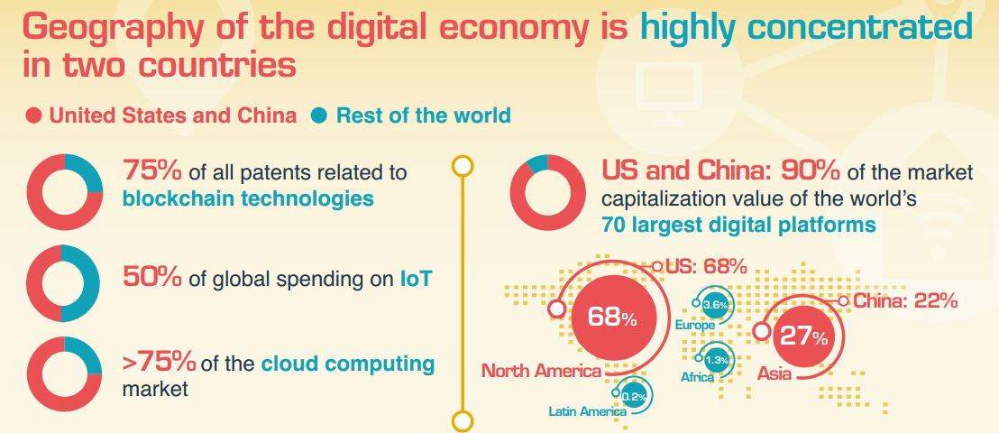

Digital Economy Layers 
---------------------- 

What is our core bussiness?
Where we can expand?

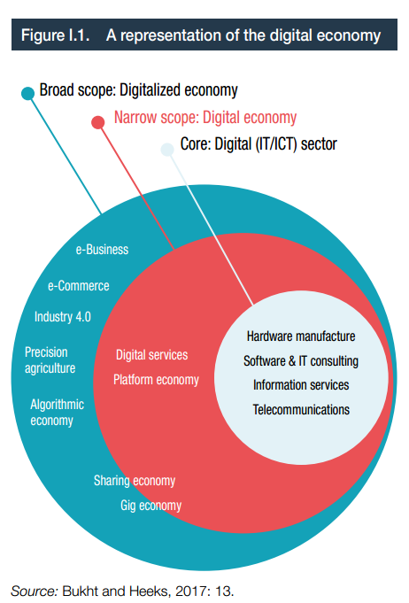

Web checking status per region
------------------------------

Analyze Iran and try to discover and identify patterns first

what is next?

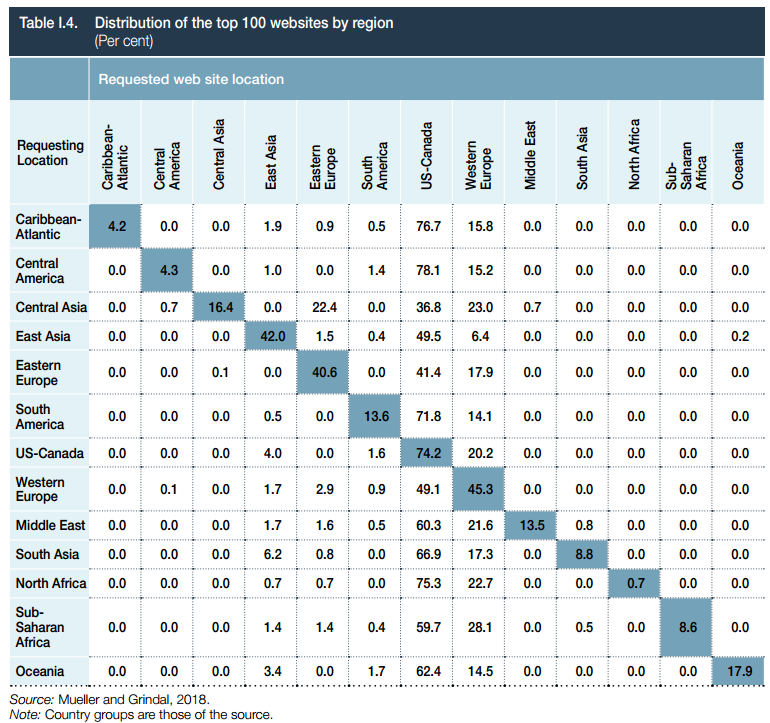

Create value from Digital 
------------------------- 

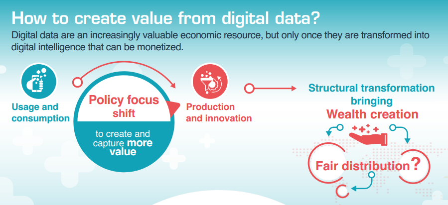

???? 
------------------------- 

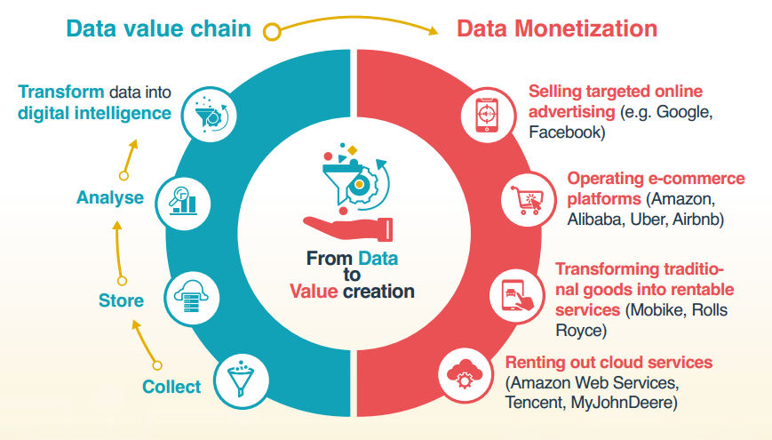

???? 
------------------------- 

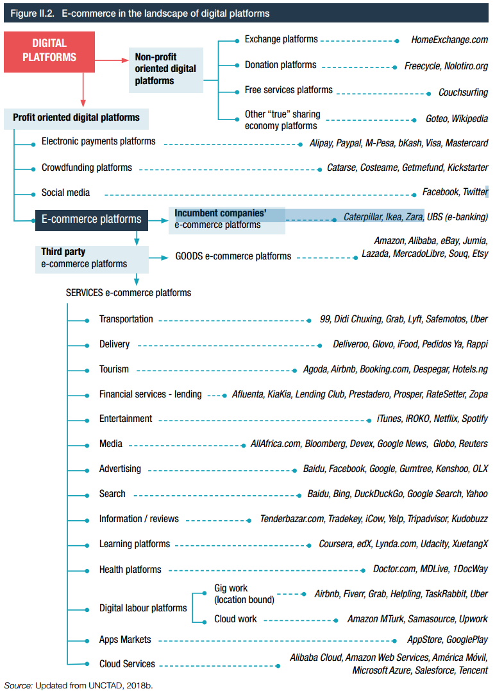
   

???? 
------------------------- 

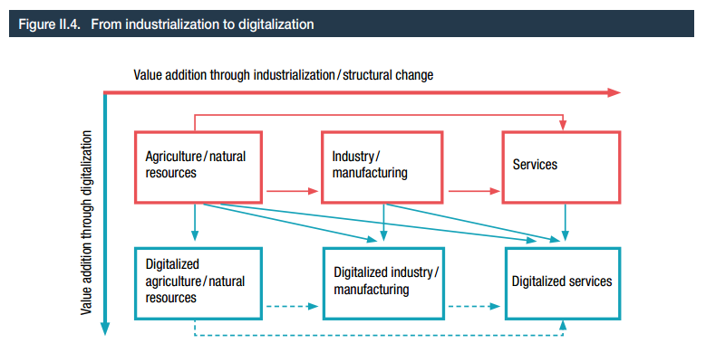

???? 
----------------------------- 

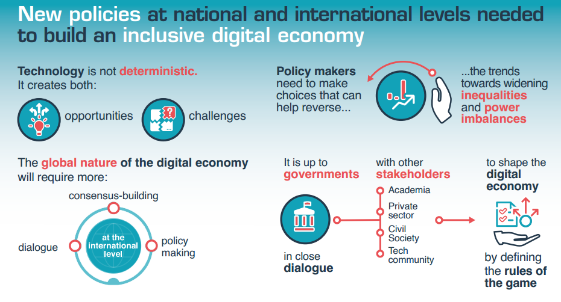

???? 
----------------------------- 

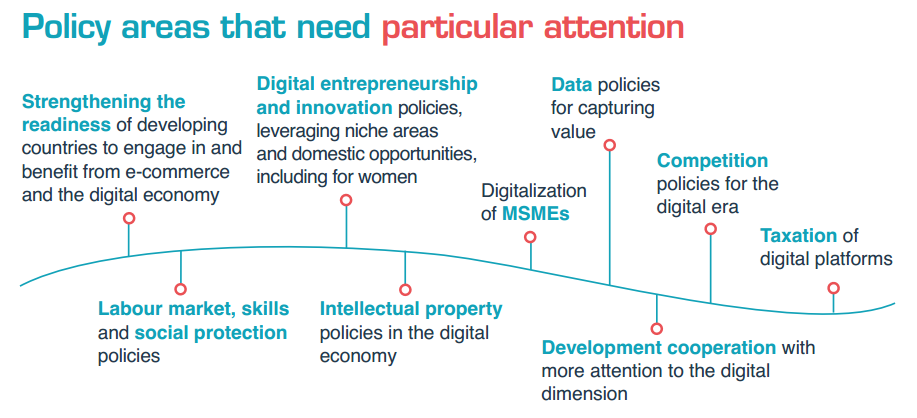

Internal Digitalization 
----------------------- 

Strategic imperative for internal digitalization ....
**What to do first?**

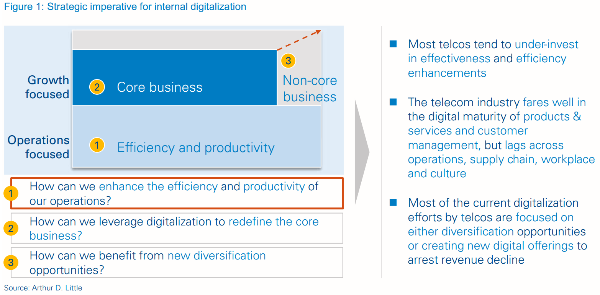

- Web link ADL_3.
.. _ADL_3:  ?

Possible applications
--------------------- 

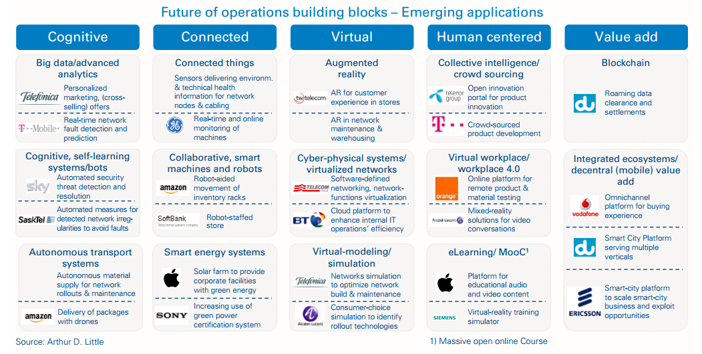

Analytics applications inside 
----------------------------- 

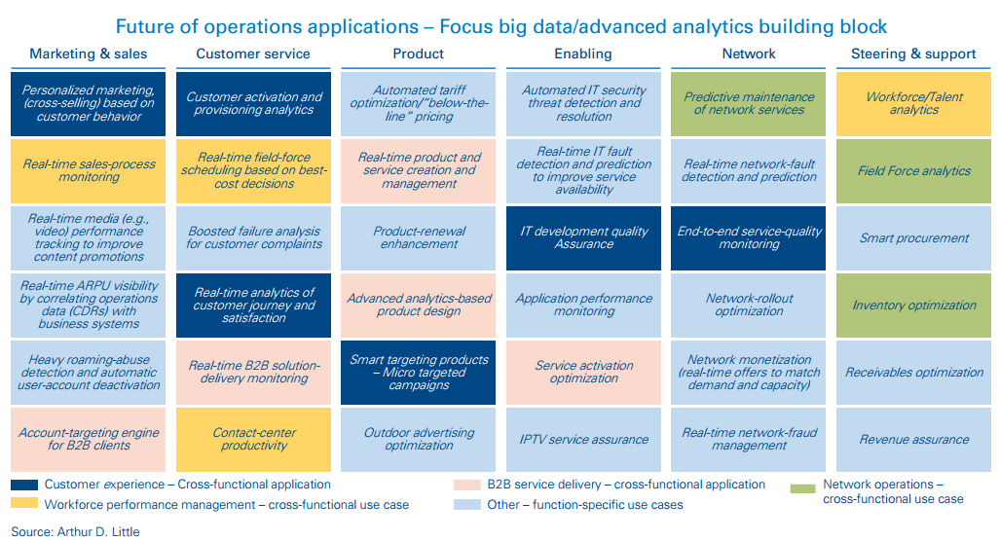

.. header::

.. image:: images/MTN logo.png
   :scale: 5 %
   :align: center
   ..:height: 5px
   ..:width: 5px
	

.. footer::

    "Hesam M.-Hosseini

.. comment 
.. https://thomas-cokelaer.info/tutorials/sphinx/rest_syntax.html

Redefining the operating model 
------------------------------

    ADL : why and how we need to redefine?
	existing challenges

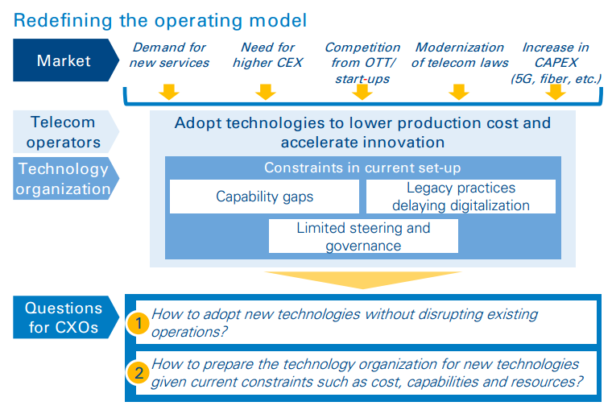

..https://www.adlittle.com/en/insights/viewpoints/beyond-traditional-network-it-organizations

----

Making challenges like Kaggle and share masked dataset 
------------------------------------------------------
	- others to partially solve our need

----

API based products /interactions with others 
--------------------------------------------
API as products
---------------
	- internal API (API based dataset providing)
	- Partener API
	- External / Open API
	- dataset providing
	- What are options?
	- Provide some in API market and expect ?

Sustainable Development Goals 
-----------------------------

Out of 17 sustainable development goals (SDGs) to transform world, Digital could support at least followings

- GOAL 1: No Poverty
- GOAL 3: Good Health and Well-being
- GOAL 4: Quality Education
- GOAL 5: Gender Equality
- GOAL 8: Decent Work and Economic Growth
- GOAL 9: Industry, Innovation and Infrastructure
- GOAL 10: Reduced Inequality
- GOAL 11: Sustainable Cities and Communities
- GOAL 12: Responsible Consumption and Production
- GOAL 13: Climate Action

Collaboration possibility to make value
---------------------------------------

Collaboration possibility to make value

#. Communications and Information Technology
    #. Cacheing part of Wikipedia and other useful open license content in NIN
    #. Making access content for Students free
#. Science, Research and Technology    
#. Health and Medical Education
#. Education
#. Municipality
    #. Urban mobility improvement
#. Youth Affairs and Sports

#. Cultural Heritage, Handicrafts and Tourism
#. Culture and Islamic Guidance
#. Cooperatives, Labor and Social Welfare
#. Energy
#. Industry, Mine and Trade
#. Interior
#. Roads and Urban Development

City Mobility index 
-------------------

Sample of what could be done.

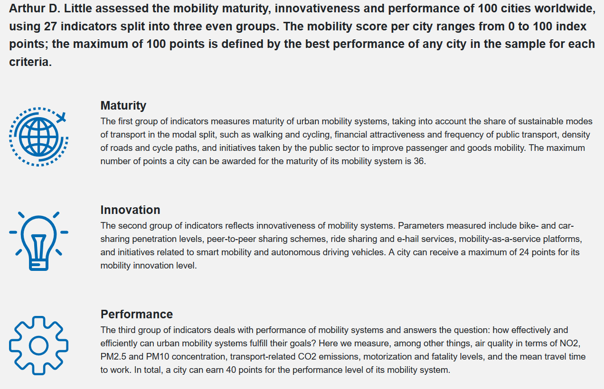

Urban mobility improvement 
--------------------------

- video demo ADL_mob_1_.

.. _ADL_mob_1: https://www.adlittle.com/futuremobilitylab/index.php#5 

- What is mobility index?
   1. Maturity

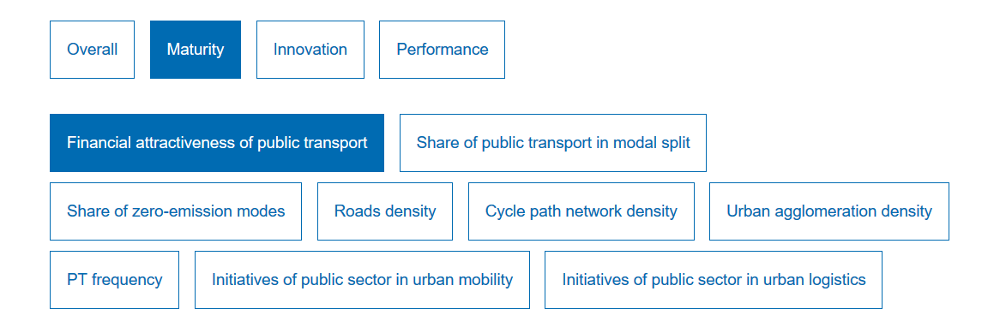
			
More Details at ADL_mob_det_1_.
.. _ADL_mob_det_1: https://www.adlittle.com/futuremobilitylab/index_10_result.php#crit1
		
	2. Innovation
		
		.. image:: images/City Mobility index parts -2.png
		[Details](https://www.adlittle.com/futuremobilitylab/index_10_result.php#crit2)
		

	3. Performance
		
		.. image:: images/City Mobility index parts -3.png
		[Details](https://www.adlittle.com/futuremobilitylab/index_10_result.php#crit3)

		
		
	- what can be done from digital point of view
	
	.. image:: images/City Mobility -Tehran among others.png
	
	- [ref](https://www.adlittle.com/futuremobilitylab/)

.. ## where to invest, advertise, expect subscriber?

.. 

---

.. math
.. math::

  W^{3\beta}_{\delta_1 \rho_1 \sigma_2} \approx U^{3\beta}_{\delta_1 \rho_1}

.. sample of source code embedding

.. sourcecode:: ipython

    In [69]: lines = plot([1,2,3])

    In [70]: setp(lines)
      alpha: float
      animated: [True | False]
      antialiased or aa: [True | False]
      ...snip

----

Here is a quick and dirty cheat sheet for some common stuff you want
to do in sphinx and ReST.  You can see the literal source for this
file at :ref:`cheatsheet-literal`.
   

.. _formatting-text:

Formatting text
===============

You use inline markup to make text *italics*, **bold**, or ``monotype``.

You can represent code blocks fairly easily::

   import numpy as np
   x = np.random.rand(12)

Or literally include code:

.. literalinclude:: pyplots/ellipses.py

.. _making-a-list:

Making a list
=============

It is easy to make lists in rest

Bullet points
-------------

This is a subsection making bullet points

* point A

* point B

* point C

Enumerated points
------------------

This is a subsection making numbered points

#. point A

#. point B

#. point C

.. _making-a-table:

Making a table
==============

This shows you how to make a table -- if you only want to make a list see :ref:`making-a-list`.

==================   ============
Name                 Age
==================   ============
John D Hunter        40 
Cast of Thousands    41
And Still More       42
==================   ============

.. _making-links:

Making links
============

It is easy to make a link to `yahoo <http://yahoo.com>`_ or to some
section inside this document (see :ref:`making-a-table`) or another
document.

You can also reference classes, modules, functions, etc that are
documented using the sphinx `autodoc
<http://sphinx.pocoo.org/ext/autodoc.html>`_ facilites.  For example,
see the module :mod:`matplotlib.backend_bases` documentation, or the
class :class:`~matplotlib.backend_bases.LocationEvent`, or the method
:meth:`~matplotlib.backend_bases.FigureCanvasBase.mpl_connect`.

Review of status in Digitalization - details 
--------------------------------------------

1. **Digitalize operations**:
Do not ignore internal processes digitalization. Ensure that the digital
strategy covers all aspects of the business and operational digitalization to achieve a superior
efficiency and cost advantage to compete with leaner and more agile competitors. [#]_ 

2. **Look for digital practices beyond the telco industry**: 
Adoption of digital technologies is evident
not only within the telco industry, but also in multiple other adjacent and unrelated industry
ecosystems. Telcos must seek inspiration from applications and use cases across industries.
3. **Transform at an optimal scale**: 
Adopt an iterative, agile and impact-oriented transformation
approach, starting with a handful of concepts, taken through various stage gates to achieve
tangible business results. Focus on achieving the initial lighthouse successful projects to inspire
the organization towards a digital operational blueprint. Opportunities for collaboration with
start-ups1 and partners must be leveraged to bring innovation from the broader ecosystem and
bridge capability gaps across the organization.
4. **Adopt a robust governance model**: 
Address the challenge of scarce capabilities and expertise
for leveraging digitalization in operations. The chosen governance should include executive
sponsorship, dedicated capabilities, expertise, and accountability to process owners
to ensure an organization-wide and sustainable transformation.

..reference place
.. [Ref1] https://www.adlittle.com/en/career/case-studies/telco-diversification-strategy-reverse-ebitda-decline  
.. [Ref2] Book or article reference, URL or whatever.
.. [Ref3] Book or article reference, URL or whatever.
